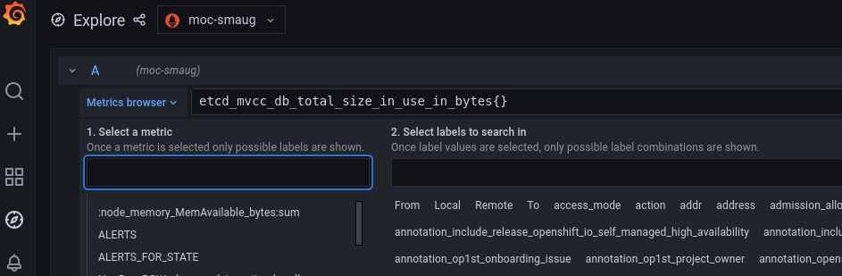

# Open Shift Logs

_(Author: Adarsh Verma)_

This repository contains step-by-step instructions for setting up, accessing and querying logs from Operate First Clusters. Operate First is a concept where open source developers bring their projects to a production cloud during development where they can interact with a cloud provider’s operators and gain valuable feedback on the operational considerations of their project. The motivation for the Operate First initiative is the shift of focus from software availability to operating services. Open Source removed the access to software as a limiting factor for businesses and individuals. However, with software proliferating into every aspect of the business – and our world in general – resulting in ever growing complexity of software stacks, the challenge is now operationalizing software.

### Onboarding Projects to OpenShift

Steps for onboarding a project to OpenShift can be found [here](onboarding_project.ipynb).   

### Grafana Dashboard Access

Steps for accessing the Grafana Dashboard can be found [here](grafana_access.md).

### Loki API Access

Steps for getting access to the Loki Query API can be found [here](loki_api_access.md).

### Generating API Bearer Token

For generating API token (expires every 24 hours) please follow the steps below:   
- Log in to your OpenShift console   
- Click on the user icon in the top right corner   
- Click on 'Copy login command'    
- Authenticate again and copy the token    

### OpenShift Alets
All alert related metrics are stored in Prometheus data source. To check out metric names, labels & other relevant information, select the campus icon on Grafana left side bar, choose the Prometheus source to query, e.g. moc-smaug. 

For alert rules & details, click the alert icon on Grafana side bar, or check out [OpenShift Runbooks](https://github.com/openshift/runbooks).

Alert rules aggregation queries are written in PromQL, for tutorial of PromQL, check out [PromQL Doc](https://prometheus.io/docs/prometheus/latest/querying/basics/).

For plain language/SQL explaination of the aggregation queries, check out [here](alert_query_desc.md).

## Additional Documents
- [Log Observations Journal](https://docs.google.com/document/d/1Pb0xdlxUSjIeKBK-z8UvV4CpFFLiU4pHJz5MjZUl3b8/edit?usp=sharing)   
- [App Logs Schema](https://docs.google.com/spreadsheets/d/1rc27blmGv2Q7XQ95TIE6uYV3ZH4j88I7l_0s3AI_-AA/edit?usp=sharing)   
- [Infra Logs Schema](https://docs.google.com/spreadsheets/d/1iGsMmsCIXoQgZ2wle5LATY2yW7-Vk5qRYtzQvtsT_N0/edit?usp=sharing)   
- [App logs Info](https://docs.google.com/spreadsheets/d/1vdkNt7DVggA9xC6gzvboJqgFuJvdzMJ2CeVR6T5wXsA/edit?usp=sharing)   
- [Infra Logs Info](https://docs.google.com/spreadsheets/d/1y2tYWfV2Jn52cCQ5rnY-AyHtrPl9z-qrftE2g4qAvcs/edit?usp=sharing)   