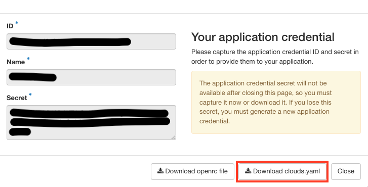

# Kubernetes Deployment on Chameleon Cloud with Ansible [Tested on Mac M1 Ventura 13.01]

This is the Ansible playbook to automate the deployment of the benchmark applications on k8s clusters on Chameleon Cloud.

## Prerequisites (local machine)

1. Python 3.5 or greater is required to use Chameleon Cloud CLI and Ansible. To install Python and pip, please follow these [instructions](https://www.makeuseof.com/how-to-install-python-on-mac/#:~:text=How%20to%20Install%20Python%20With%20the%20Official%20Installer). 
To verify the installation, use the command
      ```
      python3 --version
      ```

2. **Chameleon Cloud (CC)** setup

    1.1 Have access to a CC account and the appropriate project.

    1.2 Have the Chameleon Cloud CLI installed. The CLI installation has 2 components namely the **OpenStack client** and the **Blazar client**.
    
    ```
    pip install python-openstackclient
    ```
    To verify the installation run the command
    ```
    openstack --version
    ```

    Now, we have to install the Blazar CLI client so that we can make reservations using the CLI. To install the Blazar CLI client use the command
    ```
    pip install git+https://github.com/chameleoncloud/python-blazarclient@chameleoncloud/xena
    ```
    To verify the installation run the command
    ```
    blazar --version
    ```
    For more information, please refer to the documentation [here](https://chameleoncloud.readthedocs.io/en/latest/technical/cli.html#cli). 
    
    1.3 We need to authenticate the installed CLI by creating an application credential. To create an application credential, we have to navigate to the Chameleon website of a specific site. At this time, we have chosen the TACC site (since it has the highest amount resources amongst other sites). 
    
    1. Use this [link](https://chi.tacc.chameleoncloud.org/) to go to the TACC website.
    2. In the menu on the left side of the page, click on `Identity -> Application Credentials`.
    3. Click on `+ Create Application Credential` and we should see a pop-up.
    4. Fill in the following fields. The rest of the fields can be left empty.
      - Name
      - Expiration Date
      - Expiration Time
      - Check the `Unrestricted (dangerous)` to be able to use the Blazar client to make reservations.
      
     When we click on `Create Application Credential`, we should see a new pop-up menu as shown below. Download the `clouds.yaml` file, we will use it in the next steps.

     
    
    
    The `openrc` file (not required) has to be downloaded if we are running `openstack` commands outside of this Ansible playbook.


3. Have Ansible installed and configured. Please check this [link](https://docs.ansible.com/ansible/latest/installation_guide/intro_installation.html) for installation instructions.

    If Python and pip are already installed on the local system, just run the below command to install Ansible.
    ```
    python3 -m pip install ansible
    ```

    To verify the installation, use the below command.
    ```
    ansible --version
    ```
    The version displayed by this command is for the associated ansible-core package that has been installed.

4. [TODO](https://chameleoncloud.readthedocs.io/en/latest/technical/reservations.html) - Include tips on what filter conditions to use when reserving instances, to maximize resource availability.


## Configurable parameters

The automation supports a number of configurable parameters all of which are defined in the `chameleon-cloud-migration/local/vars/main.yaml`. 

For details about the parameter descriptions, please refer to [Configurable Parameters](./docs/configurable_parameters.md).

> _Note: At this time, only Chameleon Cloud specific parameters are included in the file. `Sucrose` application parameters will be merged soon._

## Cluster deployment instructions

> _**Note:** The playbook does not account for existing resources at this time. Please make sure that the identifiers of the newly created resources do not collide with the existing resource identifiers._

### Steps to run the playbook
1. On your local machine, navigate to a directory of your choice, then clone the `kabilan` branch from the [repository](https://github.com/jliagouris/openshift-logs/) to the current directory. The branch contains the playbook and all the roles to successfully deploy multiple k8s clusters along with the selected benchmark application. Use the following command to clone the specific branch from the repo into the current directory.

```
git clone --branch kabilan https://github.com/jliagouris/openshift-logs
```

2. Navigate to the `chameleon-cloud-migration` directory.
```
cd ./openshift-logs/chameleon-cloud-migration
```

1. Copy the `clouds.yaml` file downloaded previously, into the `playbooks` sub-directory in the `chameleon-cloud-migration` directory.
   
2. Run the `k8s-deployment.yml` playbook present in the playbooks directory.
```
ansible-playbook playbooks/k8s-deployment.yml --ask-become-pass
```
The `--ask-become-pass` requires us to enter our local machine's login password. It grants the necessary permissions and enables us to run the playbook.

The playbook takes roughly 40 minutes to finish, with most of the time spent on instance creation on Chameleon Cloud. Once the playbook run is over, we can login to the Chameleon Cloud GUI to view the provisioned resources.

## Terminologies

* `Ansible role` : A role in Ansible corresponds to a set of tasks that a specified set of hosts perform.


## Project file and directory descriptions

The contents of the `chameleon-cloud-migration` directory include the following files and sub-directories.

**Directories**

  * `inventory` : Ansible requirement. Stores the IPs of the remote hosts.
  * `kube_head` : Ansible requirement. The directory corresponds to an Ansible role specific to the k8s control plane nodes.
  * `kube_worker` : Ansible requirement. The directory corresponds to an **Ansible role** specific to the k8s worker nodes.
  * `playbooks` : Ansible requirement. Stores the playbooks to provision and delete the provisioned resources.
  * `local` : Ansible requirement. The directory corresponds to an **Ansible role** specific to our local machine.
  * `benchmark_application_deployer` : Ansible requirement. The directory corresponds to an **Ansible role** specific to deploying the chosen benchmark application.
  * `sucrose_deployer` : Ansible requirement. The directory corresponds to an **Ansible role** specific to deploying the sucrose application.

**Files**

  * `ansible.cfg`: Ansible requirement. Specifies configuration for the playbook run.


## Resource deletion (TODO - a separate playbook)

1. To delete the instances after testing is done, delete the lease.

2. Allocated floating-IPs have to be deleted manually.

3. Created SSH key pair has to be deleted manually.