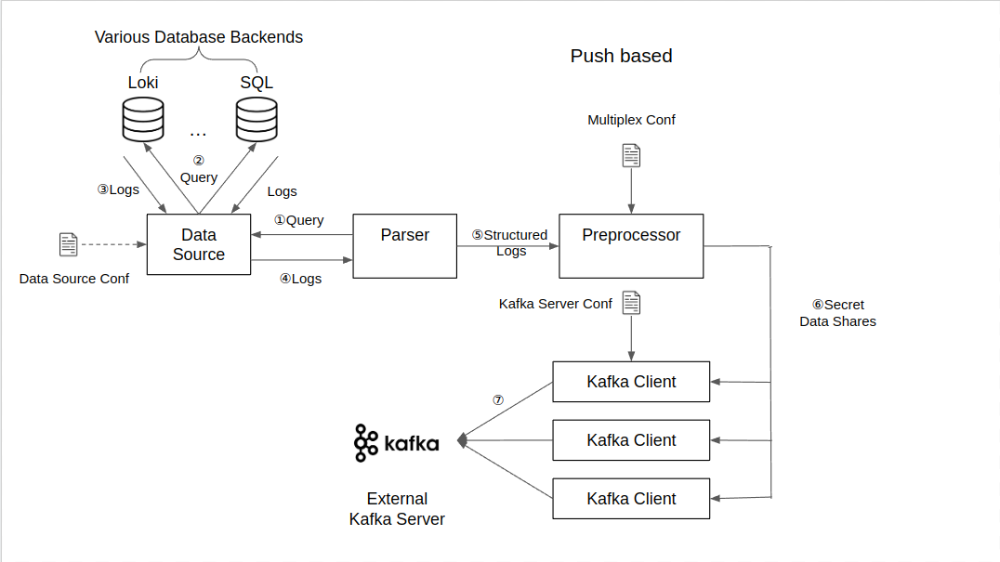
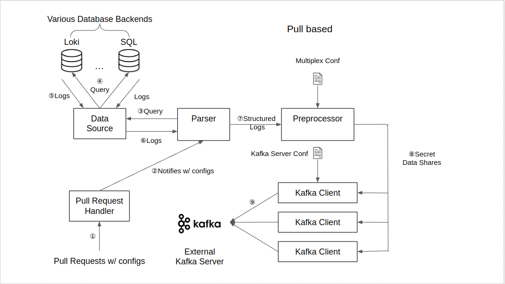

# Application for Secure Cross-Site Log Analytics using Secrecy

This is the client application that lives on the OpenShift servers of RedHat clients.

Its duty is to periodically or on demand collect, preprocess and send desensitified logs data shares to secrecy servers for further calculation.

Its development relies on Golang v1.18.2, confluent-kafka-go v1.8.2 and go-yaml v3

To install all relevant dependencies, please run: 
```shell
sh get_dependencies.sh
```

# Assumptions made:
1. All kafka producers have the same timeouts (Can be made different in future)
2. All producers push to the same single topic (Maybe different multiple topics?)

# Service workflow
To support different scenarios, the application supports two service models: periodic push
(prototype up and running), and ad-hoc pull (under development). Graphic illustrations of workflows
of the two models are as follows: 

Periodic Push:


Ad-hoc Pull:


# Configurable Parameters:
The application supports a number of configurable parameters, all defined in config.yaml. For 
details, please look at: [Configurable Parameters](docs/config_param.md).