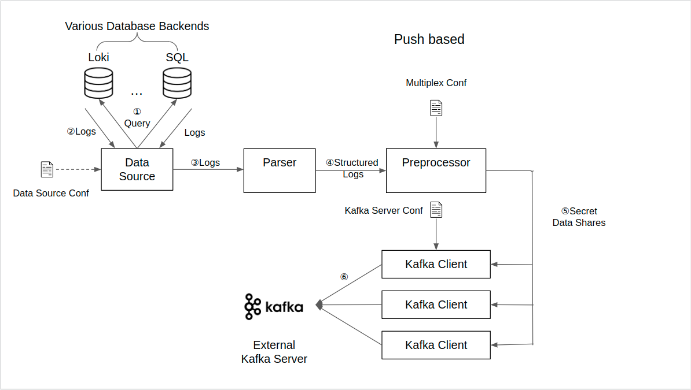
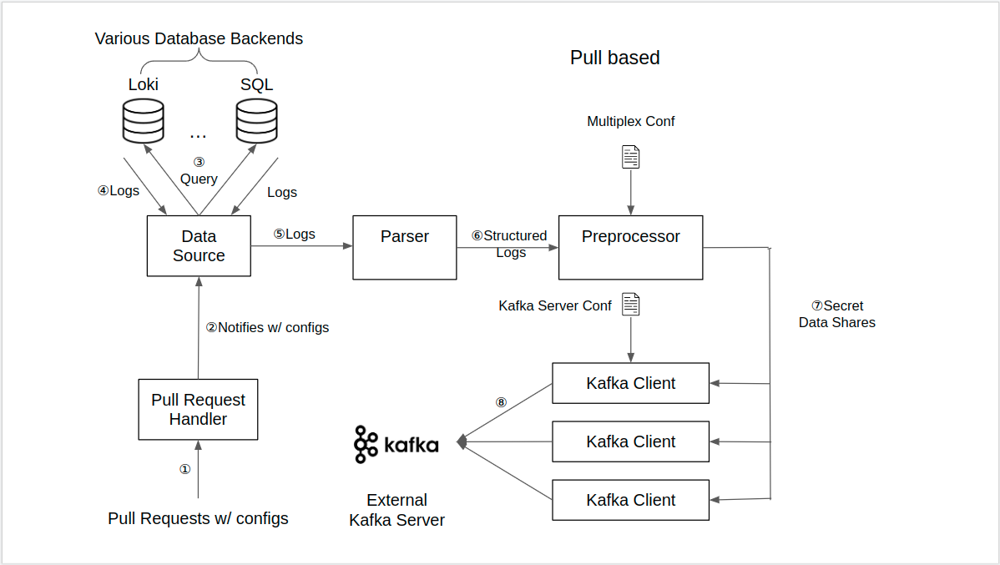

# Sucrose - Client-side Application for Secure Cross-Site Log Analytics using Secrecy

This is the client application that lives on the OpenShift servers of RedHat clients.

Its duty is to periodically or on demand collects Prometheus metrics, preprocess and send desensitified logs data shares to secrecy servers for further calculation.

Its development relies on Golang v1.19, confluent-kafka-go v1.9 and go-yaml v3, make sure they are installed before running the app.

## Assumptions made:
1. All kafka producers have the same timeouts.
2. All producers across clients push to the same topic.

## Service workflow
To support different scenarios, the application supports two service models: periodic push
(prototype up and running), and ad-hoc pull (under development). Graphic illustrations of workflows
of the two models are as follows: 

Periodic Push:


Ad-hoc Pull:


### Components:
- Data Source: Component that sends queries to Prometheus, recieves response, and sends structured response to components downstream of the pipeline.
- Parser: Parses the response and extracts predefined arguments, in order to reduce workload of downstream components.
- Preprocessor: Process data entries into format that Secrecy understands before streaming to secrecy
- Kafka client: Sends preprocessed entries to corresponding topic in external Kafka broker servers.
- Ad-hoc request listener (in ad-hoc client): always running goroutine that listens to user http requests.


## Configurable Parameters:
The application supports a number of configurable parameters, all defined in config.yaml. For 
details, please look at: [Configurable Parameters](docs/config_param.md).

## Cluster & Application Deployment
### Prerequesites:
- General: 
  
  1. Golang 1.18+, confluent-kafka-go v1.9, go-yaml v3 and python3
  2. Create an Redhat account
  3. Create an AWS account
  4. Make sure that [Openshift CLI](https://docs.openshift.com/container-platform/4.8/cli_reference/openshift_cli/getting-started-cli.html) is installed.
  5. Install and configure [Docker](https://www.docker.com/), preferably Docker Desktop, which comes with GUI.
  6. This project builds and runs successfully on Linux(Ubuntu) and MacOS. Success of building on Windows is not guaranteed (most likely it won't).
- ROSA (Redhat Openshift on AWS) cluster:
  
  1. Have [ROSA CLI](https://docs.openshift.com/rosa/rosa_cli/rosa-get-started-cli.html) installed.
  2. Have [AWS CLI 2](https://docs.aws.amazon.com/cli/latest/userguide/getting-started-install.html) installed and configured.
  3. Create service linked roles for Elastic Load Balancer(ELB) on your AWS account:
    - Check if the role exists:
     ```Bash
     aws iam get-role --role-name "AWSServiceRoleForElasticLoadBalancing"
     ```
    - If not, run:
     ```Bash
     aws iam create-service-linked-role --aws-service-name "elasticloadbalancing.amazonaws.com"
     ```
  4. Make sure that you have enough resource quota on your account: 
     ```Bash
     rosa verify quota
     ```
     If not, apply for quota increase in your AWS console.
- Chameleon
- Azure
- GCP

###
Building Instructions
*  Local Machine: run ``go build`` in project directory. It should generate an executable called "push_app" for you to run.
*  Openshift: 
   * First give build shell scripts correct privilege: 
    ```Bash
    chmod +x buildDockerImg.sh # Or buildeDockerImgAppleM1.sh if operating on mac with Aplle silicon
    ```
   * Update the repository / image name / tag as needed.
   * Update the image name in **openshift-deploy.yaml**
   * Execute the script to build the container image.
   * Some times the changes made will not be shown in the new image (I don't know why). I bypass this problem by changing image name/tag.

###
Deployment Instructions\
Installation of a cluster will likely take around an hour. The scripts will need to be updated to parallelize the process.
Run 
```Bash
./main.sh
```
To start cluster deployment and Sucrose installation
###
Deletion Instructions
Deletion of clusters are manual at this moment.
- AWS:
  ```Bash
  rosa delete cluster -c <cluster name>
  ```
  The output will include line like:
  ```
  rosa delete operator-roles -c 219b2n735i030a158nqjqhibnp8be5pn
  rosa delete oidc-provider -c 219b2n735i030a158nqjqhibnp8be5pn
  ```
  These are IAM roles and id providers created in AWS. You can either run the two commands and delete them after cluster is uninstalled, or in batch in AWS console. Make sure they don't accumulate over limit otherwise deployment will fail.

## Project File Description & Explainations
1. Components\
   Files of all components are under directory **components**, for most files their names are self explanatory, others are explained as follows:
   - common.go: contains data structure for log and processed data share entries.
   - configParser.go: parses and loads predefined parser configurations contained in ``config.yaml``.
   - listener.go (in ad-hoc): User query listener.
2. Configs\
   Files under **configs** directory corresponds to configs of components other than parser. 
   - kafkaClientConf.go: Parses and loads configurations of kafka brokers in ``config.yaml``
   - operatorConf.go: Parses and loads global application configurations in ``config.yaml``
   - prometheusConf.go: Parses and loads Prometheus configurations in ``prom_config.yaml``\
    \
  prom_config.yaml contains configuration for Prometheus datasource, config.yaml contains configuration for parser, Kafka client, and global config. rosa_config contains rosa cluster config.
3. Credentials\
  Prometheus parsing credentials are generated upon cluster creation and stored in **credentials** directory.\
  \
  Credentials for rosa openshift cluster login is stored in text file **scripts/createAdmin-rosa-\<client id>.txt** for each ROSA cluster.
1. Queries
  Files under **Queries** directory contains some sample queries as well as Prometheus response to assist understanding.
1. Response\
  **Response/PrometheusResp.go** defines data structure that holds fields of Prometheus query response.
1. scripts\
  Files under **scripts** directory are automation scripts to create and setup the cluster as well as installing Sucrose on the cluster. The names of the scripts should be self explanatory.

## TODOs
1. Automation scripts for other cloud providers (Primarily Chameleon)
2. Parallelize deployment of multiple clusters to save time.
3. Edit scripts to deploy workload from Vivek's work.
4. Combine push and ad-hoc into a single app (tried but had bugs and failed) or automate ad-hoc in the same way as push
5. Parallelization of components (autoscaling if possible)
6. Need higher EIP quota


   
  
